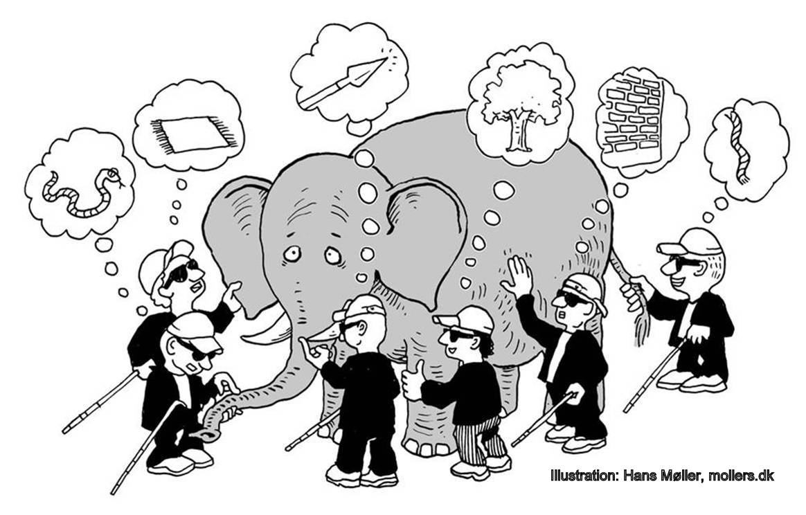

Git Training
============

Welcome.

Does this look familiar?

Sadly it's not that far from the truth for many users of Git,
and doesn't always improve with more exposure.

One anology could be made with the following comic.

In this case each blind man could represent a different Git command.
By just running the commands, there are a number of cases where
what you _think_ Git is doing is not actually what it's actually doing.

In particular this often involves commands relating to branches,
and pushing/pulling from a remote server.

This material is _not_ intended to teach how to "use" Git.
Or at least not for the most part.
The focus of this material is to focus on a few critical
aspects of Git that can often cause the most amount of confusion.

Guides
------

1. [Getting started](init.md)
2. [Commits](commit.md)
3. [Master](master.md)
4. [Branches](branches.md)
5. [Reset](reset.md)
6. [Remotes](remote.md)

References
----------

- http://www.infoq.com/presentations/A-Tale-of-Three-Trees
- https://git-scm.com/book
- http://www-cs-students.stanford.edu/~blynn/gitmagic/
- http://eagain.net/articles/git-for-computer-scientists/
